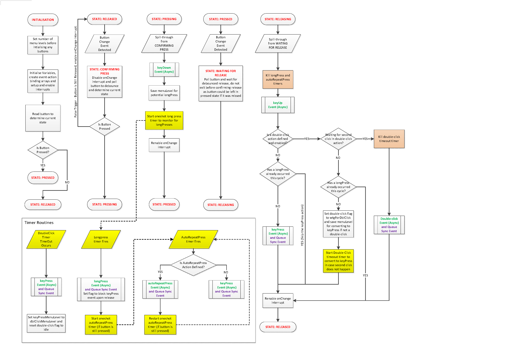

# InterruptButton (Arduino / ESP IDF)
This is highly responsive interrupt based button event library for the ESP32 suitable in the Arduino framework as well as the ESP IDF framework.  It uses the 'onChange' interrupt (rising or falling) for a given pin and the ESP high precision timer to carry the necessary pin-polling to facilitate a simple, but reliable debouncing and timing routines.  Once de-bounced, actions bound to certain button events including 'Key Down', 'Key Up', 'Key Press', 'Long Key Press', 'Auto-Repeat Press', and 'Double-clicks' are available to bind your own functions to.

How the bound functions are executed depends on the mode you have set the library to: 'Mode_Asynchronous' (actioned immediately), 'Mode_Synchronous' (actioned in main loop hook), or 'Mode_Hybrid' where 'Key Up' and 'Key Down' are Asynchronous and the remainder of events are executed Synchronously.

This makes employing extended button functions VERY. EASY. TO. DO.  Only the first 2 lines below are required to get it going:

```
  // Global variable
  InterruptButton button1(32, LOW);                                              // Monitor pin 35, LOW when pressed
  
  // Setup Function
  button1.bind(InterruptButton::Event_KeyPress, &menu0Button1keyPress);          // Bind a predefined function to the event                               
  button1.bind(InterruptButton::Event_DoubleClick, [](){ /* do stuff here */ }); // You can bind a predefined function like before or
                                                                                 // you can use LAMBDA functions
                                                                                 // (functions with no name)
                                                                                 
  // ------------------------------------------------------------------------------------------------------
  // If you have selected Mode_Synchronous, then you'll need to action the event in the main loops as below
  // ------------------------------------------------------------------------------------------------------

  // Main Loop
  button1.processSyncEvents();                                                   // Only required if using sync events
```

With a built in user-defined menu/paging system, each button can be bound to multiple layers of different functionality depending on what the user interface is displaying at a given moment.  This means it can work as a simple button, all the way up to a full user interface using a single button with different combinations of special key actions for navigation.

The use of interrupts instead of laborious button polling means that actions bound to the button are NOT limited to the main loop frequency which significantly reduces the chance of missed presses with long main loop durations.

There are 6 events and a menu/paging structure which is only limited to your memory on chip (which is huge for the ESP32).  This means you could attach 6 different functions to a single button per menu level per page.  Ie if you have a 4 page gui menu, one button associated with that menu could have up to 24 actions bound to it!

## It allows for the following:

### Event Types 
Events are actioned by calling user defined functions attached to specific button events Asynchronously via RTOS or Synchronously via main loop hook.
  * **Event_KeyDown** -   Happens anytime key is depressed (even if held), be it a keyPress, longKeyPress, or a double-click
  * **Event_KeyUp** -     Happens anytime key is released, be it a keyPress, longKeyPress, end of an AutoRepeatPress, or a double-click
  * **Event_KeyPress** -  Occurs upon keyUp only if it is not a longKeyPress, AutoRepeatPress, or double-click
  * **Event_LongKeyPress** (required press time is user configurable)
  * **Event_AutoRepeatPress** (Rapid fire, if enabled, but not defined, then the standard keyPress action is used)
  * **Event_DoubleClick** (max time between clicks is user configurable)

### Multi-page/level events
  This is handy if you have several different GUI pages where all the buttons mean something different on a different page.  
  You can change the menu level of all buttons at once using the static member function 'setMenuLevel(level)'.  Note that you must set the desired number of menus before initialising your first button, as this cannot be changed later (this may be improved later subject to user requests)
  
### Other Features
  * Each event (or all events) can enabled or disabled on a per-button basis
  * The timing for debounce, longPress, AutoRepeatPress and doubleClick can be set on a per-button basis.
  * Asynchronous events are called *Immediately* after debouncing
  * Synchronous events are invoked by calling the 'processSyncEvents()' member function in the main loop and *are subject to the main loop timing.*

### Example Usage
This is an output of the serial port from the example file.  Here just the Serial.Println() function is called, but you can replace that with your own code to do what you need.
```
EXAMPLE OUTPUT PENDING
```

## Functional Flow Diagram ##
The flow diagram below shows the basic function of the library.  It is pending an update to include some recent updates and additions such as 'autoRepeatPress'




## Roadmap Forward ##
  * Consider Adding button modes such as momentary, latching, etc.
 
## Known Limitations:
  * The Synchronous routines can be much more robust than Asynchronous routies (depending on value set for 'm_RTOSservicerStackDepth'), but are limited to the main loop frequency

### See the example file, as it covers most interesting things, but I believe it is fairly self-explanatory.

*  This libary should not be used for mission critical or mass deployments.  The developer should satisfy themselves that this library is stable for their purpose.  I feel the code works great and I generated this library because I couldn't find anything similar and the ones based on loop polling didn't work at all with long loop times.  Interrupts can be a bit cantankerous, but this seems to work nearly flawlessly in my experience, but I imagine maybe not so for everyone and welcome any suggestions for improvements.*  

Special thanks to @vortigont for all his input and feedback, particuarly with respect to methodology, implementing the ESP IDF functions to allow this library to work on both platforms, and the suggestion of RTOS queues.
